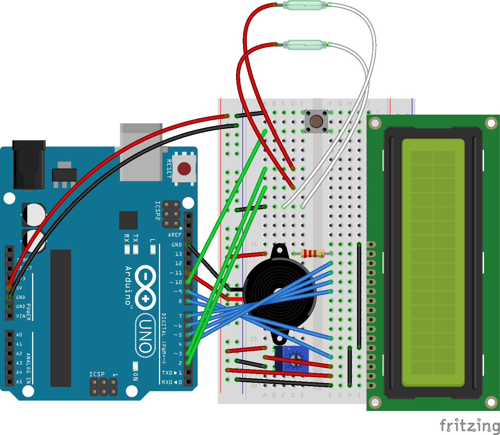

# Carrera race track timer

The goal of this project was to build a timer and lap counter for my kid's 
Carrera slot car racing track (Carrera Go!!!, 1:43).

I am using an Arduino Uno and two [reed switches](https://en.wikipedia.org/wiki/Reed_switch) as sensors. The reed switches
are mounted below the tracks and detect the magnet of the cars when the cars pass by.

The lap count, lap record and current lap time of the two cars are displayed 
on a 16x2 LCD and can be reset with a pushbutton.

The Arduino is powered by a USB battery pack.

Works like a charm!

## Code
Arduino sketch: [carreratimer.ino](./carreratimer.ino)

## Components
From Arduino Starter Kit:

* Arduino Uno
* 16x2 LCD
* jumper wires
* 220 Ohm resistor
* potentiometer
* pushbutton
* piezo buzzer

Reed swiches:

* Littlefuse MITI-3V1-6-12.5 7mm Ultra-Miniature Reed Switch, 
mounted with tape on the bottom side of the tracks

